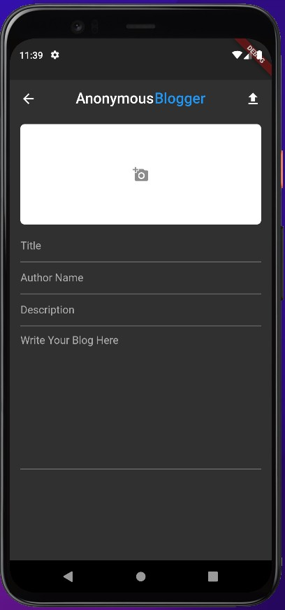

# Anonymous-Blogger
A blogging application with card view of the blogs in home page.
Made using Flutter and FireBase in the backend.

## ► Screenshots
<ul>
  <li>Home Page
    <ul style="list-style-type:none;">
  
    </ul>
  <li>Create Blog Page
        <ul style="list-style-type:none;">
  <li></li>
    </ul>
  <li>Blog Page
    <ul style="list-style-type:none;">
  <li></li>
  <li></li>
    </ul>
 </ul>

## ► Screenshots
| HomePage |
|--------------|
|  |

| CreateBlog |
|--------------|
|  |

| BlogPage |
| ---------------|------------------|
|  |  |
